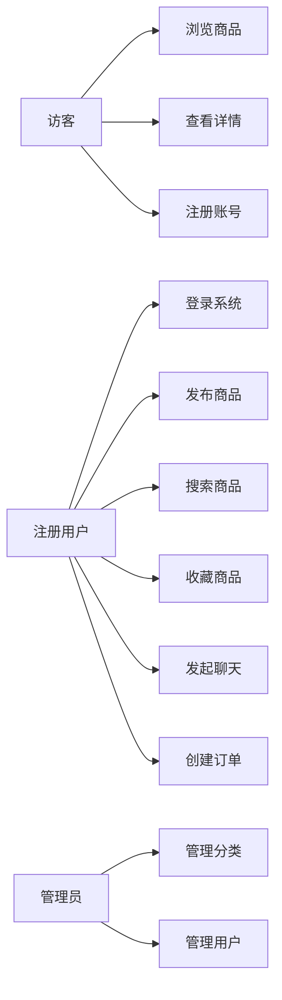

# 校园二手交易平台

## 软件工程课程期中答辩

<!-- page-break -->

***

# 答辩团队

| 角色       | 职责                  |
| -------- | ------------------- |
| 后端开发：熊兴融 | Spring Boot 后端架构与实现 |
| 前端开发：苏浩延 | Web 前端页面开发与交互       |

***

# 目录 CONTENTS

1. **项目背景与意义**
2. **项目目标**
3. **技术架构**
4. **核心功能模块**
5. **数据库设计**
6. **开发进度与里程碑**
7. **遇到的问题与解决方案**
8. **团队分工**
9. **未来展望**

***

<!-- slide -->

# 01 项目背景与意义

***

## 1.1 行业背景

高校校园内二手物品流通需求旺盛，主要痛点：

- **毕业季**：大量教材、电子产品、生活用品需要处理
- **新生入学**：对高性价比二手物品有强烈需求
- **日常流转**：闲置物品持续产生，缺乏高效流转渠道

## 1.2 现状分析

| 现有方式   | 存在问题            |
| ------ | --------------- |
| 线下摆摊   | 时间空间受限，覆盖面窄     |
| 微信/QQ群 | 信息碎片化，难检索，缺信用体系 |
| 论坛/贴吧  | 信息更新慢，交互体验差     |
| 通用二手平台 | 不聚焦校园，缺乏信任基础    |

***

## 1.3 项目意义

- **资源循环**：促进校园闲置物品高效流转，践行绿色校园理念
- **降低成本**：为学生提供高性价比的二手交易渠道
- **信任生态**：基于校园身份构建交易信用体系
- **实践价值**：完整覆盖软件工程全生命周期，具备教学意义

***

<!-- slide -->

# 02 项目目标

***

## 2.1 总体目标

构建一个面向高校师生的 **C2C 校园二手交易平台**，以"类闲鱼"模式为核心，提供从商品发布到交易完成的完整闭环。

## 2.2 核心目标

- 实现用户注册、登录、个人信息管理
- 支持商品发布、分类浏览、关键词搜索、排序筛选
- 支持商品收藏、浏览量统计
- 实现买家卖家私信聊天功能
- 实现订单创建、状态流转、交易完成确认
- 提供管理后台（分类管理、用户管理）
- 采用 RESTful API 设计，支持前后端分离

***

## 2.3 非功能性目标

| 指标             | 目标值              |
| -------------- | ---------------- |
| API 响应时间 (P95) | < 500ms          |
| 分页查询效率         | < 200ms          |
| 系统可用性          | 99.9%            |
| 密码安全           | BCrypt 强哈希加密     |
| 认证机制           | JWT 无状态 Token 认证 |
| 部署方式           | Docker 容器化一键部署   |

***

<!-- slide -->

# 03 技术架构

***

## 3.1 技术栈总览

| 层级     | 技术选型                        | 版本       |
| ------ | --------------------------- | -------- |
| 后端框架   | Spring Boot                 | 3.x      |
| 开发语言   | Java                        | 17 LTS   |
| 持久层    | MyBatis                     | 3.x      |
| 数据库    | MySQL                       | 8.0      |
| 缓存     | Redis                       | 7.x (可选) |
| 安全框架   | Spring Security + JWT       | -        |
| API 文档 | SpringDoc OpenAPI (Swagger) | 3.0      |
| 构建工具   | Maven                       | -        |
| 容器化    | Docker + Docker Compose     | -        |
| 前端框架   | Vue 3 / React (SPA)         | -        |

***

## 3.2 系统架构图

```
┌─────────────────────────────────────────────────┐
│              客户端层 (Web SPA + 移动端H5)         │
├─────────────────────────────────────────────────┤
│  API 网关: ApiVersionInterceptor + WebConfig     │
├─────────────────────────────────────────────────┤
│  安全层: JwtAuthenticationFilter + SecurityConfig │
├──────────┬──────────┬──────────┬────────────────┤
│ UserApi  │ Product  │  Chat    │ Order/Favorite │
│          │Controller│Controller│  /Category     │
├──────────┼──────────┼──────────┼────────────────┤
│  User    │ Product  │  Chat    │ Order/Favorite │
│ Service  │ Service  │ Service  │  /Category Svc │
├──────────┼──────────┼──────────┼────────────────┤
│ User     │ Product  │  Chat    │ Order/Favorite │
│ Mapper   │ Mapper   │ Mapper   │  /Category Map │
├──────────┴──────────┴──────────┴────────────────┤
│          MySQL 8.0        │     Redis 7.x       │
└─────────────────────────────────────────────────┘
```

***

## 3.3 分层架构详解

| 层次             | 职责                              | 关键类             |
| -------------- | ------------------------------- | --------------- |
| **Controller** | 接收 HTTP 请求、参数校验、调用 Service、封装响应 | 6个 Controller 类 |
| **Service**    | 核心业务逻辑、事务管理、数据转换                | 6个接口 + 6个实现类    |
| **Mapper**     | SQL 封装、ORM 映射                   | 7个 Mapper 接口    |
| **Entity**     | 数据库实体映射                         | 8个实体类           |
| **DTO/VO**     | 数据传输与视图封装                       | 12个 DTO/VO 类    |
| **Config**     | 安全、缓存、API 文档等配置                 | 10个配置类          |

***

## 3.4 安全架构

```
HTTP Request
    │
    ▼
ApiVersionInterceptor (API版本检查)
    │
    ▼
JwtAuthenticationFilter (Token验证)
    │
    ├── Token 无效/过期 → 401 Unauthorized
    │
    ▼
SecurityContext (设置认证信息)
    │
    ▼
@PreAuthorize (权限检查)
    │
    ├── 权限不足 → 403 Forbidden
    │
    ▼
Controller (业务处理)
    │
    ▼
HTTP Response (统一格式 Result)
```

**JWT Token 结构**: Header(HS256) + Payload(sub/userId/role/exp) + Signature(HMAC-SHA256)

***

<!-- slide -->

# 04 核心功能模块

***

## 4.1 功能模块总览

```
校园二手交易平台
├── M1 用户管理模块
│   ├── 注册 / 登录 / 个人信息管理
│   ├── 密码修改 / 密码重置(邮件验证码)
│   └── 学校认证信息绑定
├── M2 商品管理模块
│   ├── 商品发布 / 编辑 / 删除(软删除)
│   ├── 分类浏览 / 关键词搜索 / 排序筛选
│   ├── 成色等级 / 原价对比 / 多图展示
│   └── 浏览量统计 / 上下架切换
├── M3 聊天消息模块
│   ├── 会话创建与管理
│   ├── 文本消息收发
│   └── 已读/未读状态跟踪
├── M4 订单管理模块
│   ├── 订单创建（含商品快照）
│   ├── 卖家确认/拒绝订单
│   ├── 买家取消/确认完成
│   └── 订单状态流转管理
├── M5 收藏管理模块
│   └── 收藏/取消收藏/收藏列表
└── M6 分类管理模块 (管理员)
    ├── 树形分类结构管理
    └── 分类启用/禁用控制
```

***

## 4.2 核心用例



***

## 4.3 订单状态流转

```
[买家创建订单] ──→ pending (待确认)
                      │
            ┌─────────┼─────────┐
            ▼         ▼         ▼
      confirmed  cancelled  (买家取消)
      (卖家确认)  (卖家拒绝)
            │
            ▼
       completed
      (买家确认收货)
```

**核心设计决策**：

- **无在线支付**：线下交易为主，降低系统复杂度
- **商品快照**：订单项保存商品名称/图片/价格快照，防止源数据变更影响
- **软删除**：商品删除通过 status 标记，保留历史数据

***

## 4.4 商品特色功能

| 功能    | 说明                  | 技术实现              |
| ----- | ------------------- | ----------------- |
| 成色等级  | 1全新 \~ 5一般 的5级成色描述  | conditionLevel 字段 |
| 原价对比  | 现价 vs 原价展示，突出折扣     | originalPrice 字段  |
| 多图展示  | JSON数组存储多张商品图片      | imageUrls JSON字段  |
| 浏览量统计 | 每次详情查询自动 +1         | viewCount 字段      |
| 收藏计数  | 收藏/取消收藏时同步更新        | likeCount 字段      |
| 全文搜索  | MySQL FULLTEXT 索引支持 | FULLTEXT INDEX    |

***

<!-- slide -->

# 05 数据库设计

***

## 5.1 数据表总览

| 表名                  | 说明          | 核心字段数 |
| ------------------- | ----------- | ----- |
| users               | 用户表         | 18    |
| categories          | 商品分类表（树形结构） | 7     |
| products            | 商品表         | 14    |
| chat\_conversations | 聊天会话表       | 10    |
| chat\_messages      | 聊天消息表       | 8     |
| orders              | 订单表         | 10    |
| order\_items        | 订单项表        | 7     |
| favorites           | 收藏表         | 3     |

共 **8 张表**，满足 **第三范式 (3NF)**

***

## 5.2 ER 关系图

```
users ──1:N── products (发布)
users ──1:N── orders (买家/卖家)
users ──1:N── favorites (收藏)
users ──1:N── chat_conversations (参与)
users ──1:N── chat_messages (发送/接收)

categories ──1:N── products (分类)
categories ──1:N── categories (父子自关联)

orders ──1:N── order_items (组合)
products ──1:N── order_items (商品快照)
products ──1:N── favorites (被收藏)

chat_conversations ──1:N── chat_messages (包含)
```

***

## 5.3 设计亮点

| 设计点    | 实现方式                            | 优势           |
| ------ | ------------------------------- | ------------ |
| 商品快照   | order\_items 独立存储名称/图片/价格       | 源数据变更不影响历史订单 |
| 树形分类   | parent\_id 自关联                  | 支持无限层级分类     |
| 防重复收藏  | (user\_id, product\_id) 联合唯一索引  | 数据库层面保证唯一性   |
| 双人唯一会话 | (LEAST(u1,u2), GREATEST(u1,u2)) | 同一对用户最多一个会话  |
| 未读数追踪  | user1\_unread / user2\_unread   | 分别跟踪双方未读     |
| 全文搜索   | MySQL FULLTEXT INDEX            | 商品搜索无需 ES    |

***

<!-- slide -->

# 06 开发进度与里程碑

***

## 6.1 已完成功能

| 模块       | 功能                                      | 状态   |
| -------- | --------------------------------------- | ---- |
| 用户模块     | 注册、登录、JWT认证、个人信息管理、密码修改                 | ✅ 完成 |
| 商品模块     | 发布、编辑、删除(软删除)、上下架、浏览量统计                 | ✅ 完成 |
| 商品模块     | 分类筛选、关键词搜索、价格区间、排序、分页                   | ✅ 完成 |
| 分类模块     | 树形分类创建/编辑/启用禁用/删除                       | ✅ 完成 |
| 聊天模块     | 会话创建、消息收发、已读标记、未读计数                     | ✅ 完成 |
| 订单模块     | 订单创建、卖家确认/拒绝、买家取消/完成                    | ✅ 完成 |
| 收藏模块     | 收藏/取消收藏、收藏列表、计数同步                       | ✅ 完成 |
| 安全模块     | JWT认证链、BCrypt加密、全局异常处理                  | ✅ 完成 |
| 测试数据     | 完整种子数据 SQL（用户+商品+聊天+订单）                 | ✅ 完成 |
| Docker部署 | docker-compose 一键启动 MySQL + Redis + App | ✅ 完成 |
| API文档    | SpringDoc OpenAPI (Swagger UI) 自动生成     | ✅ 完成 |

***

## 6.2 进行中功能

| 功能        | 进展               | 预计完成  |
| --------- | ---------------- | ----- |
| 前端 SPA 开发 | 页面框架搭建完成，API 对接中 | 答辩后1周 |
| 密码重置功能    | 接口已定义，邮件服务待集成    | 答辩后1周 |
| 商品图片上传    | 接口已预留，OSS 存储待对接  | 答辩后2周 |

***

## 6.3 核心指标

| 指标            | 数值                     |
| ------------- | ---------------------- |
| Java 源文件      | 60+                    |
| Controller 类  | 6 个                    |
| Service 接口/实现 | 6 + 6                  |
| Mapper 接口     | 7 个                    |
| Entity 实体类    | 8 个                    |
| DTO/VO 类      | 12 个                   |
| REST API 端点   | 35+                    |
| SQL 建表语句      | 8 张表                   |
| 种子数据          | 5用户 + 11商品 + 3订单 + 3会话 |

***

<!-- slide -->

# 07 遇到的问题与解决方案

***

## 7.1 技术难题

### 问题 1：JWT Token 安全存储与续期

**困难**：前后端分离架构下，Token 存储位置和过期策略需要仔细设计

**解决方案**：

- 前端：Token 存储于 `localStorage`，每次请求通过 `Authorization: Bearer` 头携带
- 后端：JwtAuthenticationFilter 拦截所有请求，解析并验证 Token
- 过期策略：Token 有效期 24 小时，前端拦截 401 响应跳转登录页

***

### 问题 2：聊天消息实时性问题

**困难**：HTTP 请求-响应模式无法实现实时消息推送

**解决方案**：

- 当前方案：前端定时轮询 `GET /api/chat/conversations` 更新未读计数和最后消息
- 未来优化：引入 WebSocket + STOMP 实现推送，当前 HTTP 轮询已满足校园场景需求

***

### 问题 3：订单与商品数据一致性

**困难**：商品信息变更后，历史订单数据需要保持一致

**解决方案**：

- order\_items 表保存商品**快照数据**（product\_name, product\_image, price）
- 订单创建时，将当前商品信息复制到 order\_items
- 即使商品被编辑或删除，历史订单数据不受影响

***

## 7.2 协作挑战

### 问题 4：前后端接口联调效率

**困难**：并行开发时接口定义不明确导致返工

**解决方案**：

- 引入 SpringDoc OpenAPI (Swagger) 自动生成接口文档
- 后端先定义 DTO 和接口签名，前端根据 Swagger UI 并行开发
- 统一响应格式：`Result(code, message, data)`

### 问题 5：数据库环境不一致

**困难**：开发/测试环境数据库结构与种子数据差异

**解决方案**：

- 创建完整的 `schema-mysql.sql`（DDL）+ `data-mysql.sql`（DML）
- Docker Compose 配置 init-scripts 自动初始化
- 使用 Spring Profile 区分 dev/prod 配置

***

<!-- slide -->

# 08 团队分工

***

## 8.1 分工总览

| 成员          | 负责模块      | 主要工作                                |
| ----------- | --------- | ----------------------------------- |
| 成员A (项目经理)  | 整体规划+后端核心 | Spring Boot 项目架构搭建、安全模块、用户模块、系统设计文档 |
| 成员B (后端开发)  | 商品+分类模块   | 商品 CRUD、搜索排序、分类管理、API 文档            |
| 成员C (后端开发)  | 聊天+订单模块   | 聊天消息系统、订单状态流转、事务管理                  |
| 成员D (前端开发)  | Web 前端    | Vue/React SPA 框架、页面开发、API 对接        |
| 成员E (测试+文档) | 测试+部署     | 单元测试、集成测试、Docker 部署、种子数据            |

***

## 8.2 协作模式

| 协作工具       | 用途                            |
| ---------- | ----------------------------- |
| Git        | 代码版本管理                        |
| GitHub     | 代码托管、Issue 跟踪、Pull Request 审查 |
| Swagger UI | 前后端接口联调文档                     |
| Docker     | 统一的运行环境                       |
| 飞书/微信      | 日常沟通与进度同步                     |

***

## 8.3 开发规范

- **分支策略**：`main`(稳定) → `dev`(开发) → `feature/xxx`(功能分支)
- **提交规范**：`feat:` 新功能 / `fix:` 修复 / `docs:` 文档 / `refactor:` 重构
- **代码规范**：统一使用 Lombok 简化代码，遵循阿里巴巴 Java 开发手册
- **注释规范**：所有 public 方法必须写 JavaDoc，关键逻辑写行内注释

***

<!-- slide -->

# 09 未来展望

***

## 9.1 短期计划（答辩后1个月内）

- 完成前端 SPA 全部页面开发与 API 对接
- 集成邮件服务，实现密码重置功能
- 补充单元测试和集成测试，提升代码覆盖率
- 完成系统部署与线上演示

## 9.2 中期计划

| 功能      | 技术方案              | 优先级 |
| ------- | ----------------- | --- |
| 实时消息推送  | WebSocket + STOMP | 高   |
| 图片/文件上传 | 阿里云 OSS / 腾讯云 COS | 高   |
| 在线支付    | 支付宝/微信支付 SDK      | 中   |
| 全文搜索优化  | Elasticsearch     | 中   |
| 推荐系统    | 协同过滤算法            | 低   |

***

## 9.3 技术提升方向

| 方向    | 说明                                |
| ----- | --------------------------------- |
| 微服务化  | 将用户/商品/订单/聊天拆分为独立微服务，Spring Cloud |
| 容器编排  | Docker 部署 → Kubernetes 弹性扩缩容      |
| CI/CD | GitHub Actions 自动化测试与部署           |
| 监控告警  | Prometheus + Grafana 系统监控         |
| 安全加固  | 接口限流、防刷、SQL 注入防护、内容审核             |

***

<!-- slide -->

# 总结

***

## 项目亮点

1. **完整的 C2C 交易闭环**：从发布、浏览、沟通到成交，覆盖全流程
2. **类闲鱼体验**：成色等级、原价对比、私信聊天、收藏等功能
3. **合理的技术选型**：Spring Boot + MyBatis + JWT + Docker，实用稳定
4. **扎实的工程设计**：分层架构、数据快照、软删除、防重复约束
5. **规范的工程实践**：RESTful API、Swagger 文档、统一异常处理、Docker 容器化
6. **完善的文档体系**：系统设计说明书 + API 文档 + 答辩 PPT

***

## 致谢

感谢老师的悉心指导！

感谢团队成员的共同努力！

***

<!-- slide -->

# Q & A

## 欢迎提问

***

<!-- meta
title: 校园二手交易平台 - 软件工程期中答辩
author: 软件工程课程团队
date: 2026-04
version: 1.0
totalSlides: 18
-->
