# 校园二手交易平台系统设计说明书

## 摘要

本文档采用面向对象分析方法（Object-Oriented Analysis, OOA），对"校园二手交易平台"进行全面的系统设计。系统面向高校师生群体，构建C2C（Consumer-to-Consumer）模式的二手商品交易环境，提供商品发布、分类浏览、关键词搜索、私信协商、订单管理等核心功能。文档从需求分析出发，依次阐述了系统静态模型（类识别、属性与操作定义、类图）、动态模型（顺序图、活动图、状态图）、数据库设计、用户界面设计、系统组件划分与物理部署架构。系统采用Spring Boot 3.x作为后端框架，MyBatis作为持久层方案，MySQL作为关系型数据库，Redis作为缓存中间件，Spring Security结合JWT实现无状态认证。本文档为后续的系统实现、测试与运维工作提供了完整的技术依据和设计指导。

**关键词**：校园二手交易；面向对象分析；C2C平台；Spring Boot；系统设计；JWT认证；RESTful API

## 第一章 需求分析

### 1.1 系统开发的背景

随着高校规模的不断扩大和在校生人数的持续增长，校园内二手物品流通需求日益旺盛。每年毕业季，大量毕业生面临书籍教材、电子产品、生活用品等物品的处理问题；同时，在校生也有购买高性价比二手物品的强烈需求。当前校园二手交易主要依赖以下方式：

- **线下摆摊**：时间空间受限，覆盖面窄，信息传播效率低
- **社交群组（微信群/QQ群）**：信息碎片化严重，检索困难，缺乏信用体系
- **二手论坛/贴吧**：信息更新不及时，交互体验差，无法实时沟通
- **通用二手平台（闲鱼/转转）**：面向全社会，缺乏校园场景针对性，信任基础薄弱

上述方式存在以下核心痛点：

1. **信息不对称**：买卖双方难以高效匹配需求
2. **信任缺失**：缺乏基于校园身份的认证体系，交易风险高
3. **交易流程不完整**：缺少从浏览、沟通到成交的完整闭环
4. **商品管理缺失**：无分类、无搜索、无浏览统计，用户体验差

本系统拟构建一个面向高校师生的C2C（Consumer-to-Consumer）校园二手交易平台，以类"闲鱼"模式为核心，提供商品发布、分类浏览、关键词搜索、私信协商、订单管理等完整功能。系统聚焦校园场景，依托学校信息认证建立信任基础，替代传统线下二手交易方式，预期带来以下价值：

- **资源循环利用**：促进校园内闲置物品高效流转，减少浪费
- **降低交易成本**：为学生提供高性价比的购买渠道
- **提升交易体验**：提供从发布到成交的线上化全流程服务
- **构建校园信任生态**：基于学校身份认证的交易信任体系

### 1.2 用例识别

#### 主要参与者（Actor）

| 参与者   | 说明                          |
| ----- | --------------------------- |
| 访客    | 未登录系统的用户，仅具备浏览和注册权限         |
| 注册用户  | 已完成注册和登录的校园用户，拥有全部业务功能权限    |
| 系统管理员 | 负责系统基础数据维护（如分类管理）、用户管理、系统监控 |

#### 参与者与用例映射

**访客（Visitor）用例：**

| 用例编号    | 用例名称   | 说明            |
| ------- | ------ | ------------- |
| UC-V-01 | 浏览商品列表 | 查看在售商品，支持分页   |
| UC-V-02 | 查看商品详情 | 查看商品详细信息及卖家信息 |
| UC-V-03 | 注册账号   | 填写注册信息创建账户    |

**注册用户（Registered User）用例：**

| 用例编号    | 用例名称    | 说明              |
| ------- | ------- | --------------- |
| UC-U-01 | 登录系统    | 使用用户名和密码登录      |
| UC-U-02 | 管理个人信息  | 查看和编辑个人资料       |
| UC-U-03 | 修改密码    | 修改登录密码          |
| UC-U-04 | 发布商品    | 创建新的商品出售信息      |
| UC-U-05 | 编辑商品    | 修改已发布商品信息       |
| UC-U-06 | 下架/删除商品 | 将商品下架或软删除       |
| UC-U-07 | 搜索商品    | 按关键词、分类、价格等条件搜索 |
| UC-U-08 | 收藏商品    | 将感兴趣的商品加入收藏列表   |
| UC-U-09 | 取消收藏    | 从收藏列表中移除商品      |
| UC-U-10 | 查看收藏列表  | 浏览自己收藏的所有商品     |
| UC-U-11 | 发起聊天    | 与卖家建立私信会话       |
| UC-U-12 | 发送消息    | 在会话中发送文本消息      |
| UC-U-13 | 查看消息历史  | 浏览会话中的聊天记录      |
| UC-U-14 | 标记消息已读  | 将未读消息标记为已读      |
| UC-U-15 | 创建订单    | 针对商品发起购买订单      |
| UC-U-16 | 查看订单列表  | 查看买家或卖家维度的订单    |
| UC-U-17 | 确认/拒绝订单 | 卖家处理待确认订单       |
| UC-U-18 | 取消订单    | 买家取消已创建的订单      |
| UC-U-19 | 确认交易完成  | 买家确认收到商品，完成交易   |

**系统管理员（Admin）用例：**

| 用例编号    | 用例名称    | 说明            |
| ------- | ------- | ------------- |
| UC-A-01 | 创建分类    | 添加新的商品分类      |
| UC-A-02 | 编辑分类    | 修改分类属性        |
| UC-A-03 | 删除分类    | 移除不需要的分类      |
| UC-A-04 | 启用/禁用分类 | 控制分类的可见性      |
| UC-A-05 | 查看分类树   | 浏览完整的分类层级结构   |
| UC-A-06 | 管理用户    | 查看用户列表、封禁违规用户 |

### 1.3 用例图

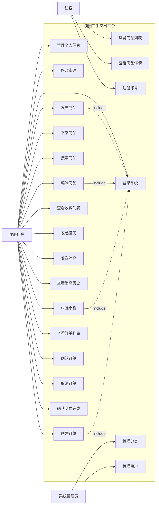

### 1.4 用例描述

#### UC-U-01 登录系统

| 项目    | 内容                                                                                                     |
| ----- | ------------------------------------------------------------------------------------------------------ |
| 用例名称  | 登录系统                                                                                                   |
| 参与者   | 注册用户                                                                                                   |
| 前置条件  | 用户已注册且账户状态为正常                                                                                          |
| 后置条件  | 用户获得JWT认证Token，可访问受保护资源                                                                                |
| 主事件流  | 1. 用户输入用户名和密码2. 系统验证参数格式3. 系统查询用户记录4. 系统验证密码（BCrypt比对）5. 系统生成JWT Token6. 系统更新用户最后登录时间7. 系统返回用户信息和Token |
| 备选事件流 | 3a. 用户不存在：系统返回"用户不存在"提示4a. 密码错误：系统返回"密码错误"提示4b. 账户已被禁用：系统返回"账户已被禁用"提示                                  |
| 业务规则  | 1. 密码采用BCrypt加密存储2. JWT Token有效期默认为24小时3. 登录失败不提示具体原因（防止用户名枚举攻击）                                       |

#### UC-U-04 发布商品

| 项目    | 内容                                                                                                              |
| ----- | --------------------------------------------------------------------------------------------------------------- |
| 用例名称  | 发布商品                                                                                                            |
| 参与者   | 注册用户                                                                                                            |
| 前置条件  | 用户已登录且账户状态正常                                                                                                    |
| 后置条件  | 商品信息写入数据库，状态为"在售"，其他用户可浏览                                                                                       |
| 主事件流  | 1. 用户填写商品信息（标题、描述、价格、分类、成色、图片等）2. 系统验证必填字段和格式3. 系统验证分类是否存在且已启用4. 系统关联当前用户为卖家5. 系统创建商品记录（状态=1在售）6. 系统返回创建成功的商品信息 |
| 备选事件流 | 2a. 必填字段缺失：系统返回参数校验错误3a. 分类不存在或已禁用：系统返回"无效分类"提示5a. 数据库写入失败：系统返回"发布失败，请稍后重试"                                     |
| 业务规则  | 1. 商品价格必须大于02. 必须指定有效的分类3. 商品图片URL列表为JSON数组格式4. 成色等级范围为1-5                                                      |

#### UC-U-11 发起聊天

| 项目    | 内容                                                                                           |
| ----- | -------------------------------------------------------------------------------------------- |
| 用例名称  | 发起聊天                                                                                         |
| 参与者   | 注册用户                                                                                         |
| 前置条件  | 用户已登录，目标用户存在                                                                                 |
| 后置条件  | 创建或返回已存在的聊天会话                                                                                |
| 主事件流  | 1. 用户在商品详情页或卖家主页点击"聊一聊"2. 系统查询是否已存在与该用户的会话3a. 若存在：直接返回已有会话3b. 若不存在：创建新会话，关联商品（可选）4. 系统返回会话信息 |
| 备选事件流 | 2a. 尝试与自己建立会话：系统返回"无法与自己聊天"提示3b-1. 创建会话失败：系统返回"会话创建失败"                                       |
| 业务规则  | 1. 同一对用户之间只允许存在一个会话2. user1Id和user2Id按用户ID大小排序存储，确保唯一性3. 可关联商品ID用于商品咨询场景                     |

#### UC-U-16 创建订单

| 项目    | 内容                                                                                                                                 |
| ----- | ---------------------------------------------------------------------------------------------------------------------------------- |
| 用例名称  | 创建订单                                                                                                                               |
| 参与者   | 注册用户（买家）                                                                                                                           |
| 前置条件  | 用户已登录，目标商品状态为"在售"                                                                                                                  |
| 后置条件  | 订单记录创建，状态为"待确认"，等待卖家处理                                                                                                             |
| 主事件流  | 1. 买家在商品详情页点击"立即购买"2. 买家填写备注和交易地址3. 系统验证商品是否存在且可售4. 系统验证买家不能购买自己的商品5. 系统生成唯一订单编号6. 系统创建订单记录（状态=pending）7. 系统创建订单项（商品快照）8. 系统返回订单详情 |
| 备选事件流 | 3a. 商品不存在或已下架：系统返回"商品不可用"4a. 买家为商品卖家本人：系统返回"不能购买自己的商品"7a. 数据库写入失败：系统回滚事务，返回"订单创建失败"                                                |
| 业务规则  | 1. 订单号格式：yyyyMMddHHmmss + 4位随机数2. 订单项需保存商品名称、图片、价格快照3. 订单创建和订单项创建必须在同一事务中完成                                                        |

#### UC-U-18 确认订单（卖家操作）

| 项目    | 内容                                                                        |
| ----- | ------------------------------------------------------------------------- |
| 用例名称  | 确认/拒绝订单                                                                   |
| 参与者   | 注册用户（卖家）                                                                  |
| 前置条件  | 用户已登录且为该订单的卖家，订单状态为"待确认"                                                  |
| 后置条件  | 订单状态变更为"已确认"或"已取消"                                                        |
| 主事件流  | 1. 卖家在订单列表查看待确认订单2. 卖家选择"确认接单"或"拒绝"3. 系统验证用户权限和订单状态4. 系统更新订单状态5. 系统返回操作结果 |
| 备选事件流 | 3a. 非订单卖家操作：系统返回"无权操作"3b. 订单状态非"待确认"：系统返回"订单状态不允许此操作"                     |
| 业务规则  | 1. 只有卖家可以确认或拒绝订单2. 确认后的订单状态为"confirmed"，不可再拒绝3. 拒绝等同于买家取消订单               |

#### UC-A-01 管理分类

| 项目    | 内容                                                                              |
| ----- | ------------------------------------------------------------------------------- |
| 用例名称  | 管理分类                                                                            |
| 参与者   | 系统管理员                                                                           |
| 前置条件  | 管理员已登录                                                                          |
| 后置条件  | 分类信息变更，影响商品分类关联                                                                 |
| 主事件流  | 1. 管理员进入分类管理界面2. 系统展示分类树形结构3. 管理员执行操作（创建/编辑/删除/启用/禁用）4. 系统验证操作合法性5. 系统执行变更并返回结果 |
| 备选事件流 | 3a. 删除有子分类的分类：系统返回"请先删除子分类"3b. 删除有关联商品的分类：系统返回"该分类下存在商品"                        |
| 业务规则  | 1. 分类支持树形结构（通过parentId实现）2. 禁用的分类不可用于新商品发布3. 根分类的parentId为NULL                  |

## 第二章 系统静态模型

### 2.1 类的识别

根据需求分析，识别出以下核心类：

| 类名                      | 类型    | 主要职责                  |
| ----------------------- | ----- | --------------------- |
| User                    | 实体类   | 管理用户基本信息、认证凭据、个人偏好    |
| Product                 | 实体类   | 管理商品信息、定价、成色、交易条件     |
| Category                | 实体类   | 管理商品分类的树形结构           |
| Order                   | 实体类   | 管理交易订单的状态和基本信息        |
| OrderItem               | 实体类   | 管理订单中的商品项（快照数据）       |
| ChatConversation        | 实体类   | 管理用户间的私信会话            |
| ChatMessage             | 实体类   | 管理聊天会话中的单条消息          |
| Favorite                | 实体类   | 管理用户对商品的收藏关系          |
| AuditLog                | 实体类   | 记录系统关键操作的审计日志         |
| UserServiceImpl         | 服务类   | 实现用户注册、登录、资料管理等业务逻辑   |
| ProductServiceImpl      | 服务类   | 实现商品CRUD、搜索、统计等业务逻辑   |
| CategoryServiceImpl     | 服务类   | 实现分类树构建、分类CRUD等业务逻辑   |
| ChatServiceImpl         | 服务类   | 实现会话管理、消息收发等业务逻辑      |
| OrderServiceImpl        | 服务类   | 实现订单创建、状态流转等业务逻辑      |
| FavoriteServiceImpl     | 服务类   | 实现收藏/取消收藏等业务逻辑        |
| UserApi                 | 控制器类  | 处理用户相关的HTTP请求         |
| ProductController       | 控制器类  | 处理商品相关的HTTP请求         |
| ChatController          | 控制器类  | 处理聊天相关的HTTP请求         |
| OrderController         | 控制器类  | 处理订单相关的HTTP请求         |
| CategoryApi             | 控制器类  | 处理分类相关的HTTP请求         |
| FavoriteController      | 控制器类  | 处理收藏相关的HTTP请求         |
| SecurityConfig          | 配置类   | 配置Spring Security安全策略 |
| JwtAuthenticationFilter | 过滤器类  | 拦截请求并验证JWT Token      |
| JwtUtil                 | 工具类   | 提供JWT Token生成和解析功能    |
| GlobalExceptionHandler  | 异常处理类 | 统一处理Controller层抛出的异常  |
| UserRegisterDTO         | 数据传输类 | 封装用户注册请求参数            |
| UserLoginDTO            | 数据传输类 | 封装用户登录请求参数            |
| UserVO                  | 视图对象类 | 封装返回给前端的用户信息          |
| ProductCreateDTO        | 数据传输类 | 封装商品创建请求参数            |
| ProductQueryDTO         | 数据传输类 | 封装商品查询条件              |
| ProductVO               | 视图对象类 | 封装返回给前端的商品信息          |
| Result                  | 通用类   | 统一API响应格式封装           |

### 2.2 类的属性与操作

#### 2.2.1 User 类

| 属性名          | 数据类型          | 可见性     | 说明              |
| ------------ | ------------- | ------- | --------------- |
| id           | Long          | private | 用户唯一标识（主键）      |
| username     | String        | private | 登录用户名（唯一）       |
| passwordHash | String        | private | BCrypt加密后的密码哈希  |
| phone        | String        | private | 手机号码            |
| email        | String        | private | 邮箱地址            |
| nickname     | String        | private | 显示昵称            |
| avatar       | String        | private | 头像URL           |
| gender       | Integer       | private | 性别（0未知/1男/2女）   |
| school       | String        | private | 学校名称            |
| major        | String        | private | 专业              |
| grade        | String        | private | 年级              |
| wechat       | String        | private | 微信号             |
| qq           | String        | private | QQ号             |
| bio          | String        | private | 个人简介            |
| isStudent    | Boolean       | private | 是否在校学生          |
| status       | Integer       | private | 状态（0禁用/1正常/2封禁） |
| lastLoginAt  | LocalDateTime | private | 最后登录时间          |
| createdAt    | LocalDateTime | private | 创建时间            |
| updatedAt    | LocalDateTime | private | 更新时间            |

| 操作名                    | 参数                     | 返回值    | 说明             |
| ---------------------- | ---------------------- | ------ | -------------- |
| register               | UserRegisterDTO        | UserVO | 执行用户注册流程       |
| login                  | String, String         | UserVO | 执行用户登录并返回Token |
| getUserInfo            | Long                   | UserVO | 根据ID获取用户信息     |
| updateProfile          | Long, User             | UserVO | 更新用户个人资料       |
| updatePassword         | Long, String, String   | void   | 修改用户密码         |
| sendResetCode          | String                 | void   | 发送密码重置验证码      |
| verifyAndResetPassword | String, String, String | void   | 验证验证码并重置密码     |

#### 2.2.2 Product 类

| 属性名            | 数据类型          | 可见性     | 说明                   |
| -------------- | ------------- | ------- | -------------------- |
| id             | Long          | private | 商品唯一标识（主键）           |
| name           | String        | private | 商品标题                 |
| description    | String        | private | 商品详细描述               |
| price          | BigDecimal    | private | 现售价格                 |
| originalPrice  | BigDecimal    | private | 原价（全新价格）             |
| categoryId     | Long          | private | 所属分类ID（外键）           |
| sellerId       | Long          | private | 卖家用户ID（外键）           |
| conditionLevel | Integer       | private | 成色等级（1全新-5一般）        |
| imageUrls      | String        | private | 商品图片URL列表（JSON数组）    |
| coverImage     | String        | private | 封面图片URL              |
| status         | Integer       | private | 状态（0下架/1在售/2已售/3预约中） |
| viewCount      | Integer       | private | 浏览次数                 |
| likeCount      | Integer       | private | 收藏次数                 |
| location       | String        | private | 交易地点                 |
| deliveryMethod | Integer       | private | 交付方式（1自提/2快递/3均可）    |
| createdAt      | LocalDateTime | private | 发布时间                 |
| updatedAt      | LocalDateTime | private | 更新时间                 |

| 操作名                 | 参数                           | 返回值               | 说明            |
| ------------------- | ---------------------------- | ----------------- | ------------- |
| getProductList      | ProductQueryDTO              | List\~ProductVO\~ | 分页查询商品列表      |
| getProductDetail    | Long                         | ProductVO         | 获取商品详情（增加浏览量） |
| createProduct       | ProductCreateDTO, Long       | ProductVO         | 创建新商品         |
| updateProduct       | Long, ProductUpdateDTO, Long | ProductVO         | 更新商品信息        |
| deleteProduct       | Long, Long                   | void              | 软删除商品         |
| toggleProductStatus | Long, Long, Integer          | void              | 切换商品上下架状态     |

#### 2.2.3 Order 类

| 属性名         | 数据类型          | 可见性     | 说明                                          |
| ----------- | ------------- | ------- | ------------------------------------------- |
| id          | Long          | private | 订单唯一标识（主键）                                  |
| orderNo     | String        | private | 业务订单号（唯一）                                   |
| buyerId     | Long          | private | 买家用户ID（外键）                                  |
| sellerId    | Long          | private | 卖家用户ID（外键）                                  |
| totalAmount | BigDecimal    | private | 订单总金额                                       |
| status      | String        | private | 订单状态（pending/confirmed/completed/cancelled） |
| remark      | String        | private | 买家备注                                        |
| address     | String        | private | 交易地址                                        |
| createdAt   | LocalDateTime | private | 创建时间                                        |
| updatedAt   | LocalDateTime | private | 更新时间                                        |
| completedAt | LocalDateTime | private | 完成时间                                        |

| 操作名               | 参数                   | 返回值             | 说明       |
| ----------------- | -------------------- | --------------- | -------- |
| createOrder       | OrderCreateDTO, Long | OrderVO         | 创建订单     |
| getOrderDetail    | Long, Long           | OrderVO         | 获取订单详情   |
| getBuyerOrders    | Long                 | List\~OrderVO\~ | 获取买家订单列表 |
| getSellerOrders   | Long                 | List\~OrderVO\~ | 获取卖家订单列表 |
| updateOrderStatus | Long, String, Long   | void            | 更新订单状态   |
| cancelOrder       | Long, Long           | void            | 取消订单     |
| confirmOrder      | Long, Long           | void            | 确认交易完成   |

#### 2.2.4 ChatConversation 类

| 属性名           | 数据类型          | 可见性     | 说明           |
| ------------- | ------------- | ------- | ------------ |
| id            | Long          | private | 会话唯一标识（主键）   |
| user1Id       | Long          | private | 参与者1的用户ID    |
| user2Id       | Long          | private | 参与者2的用户ID    |
| productId     | Long          | private | 关联商品ID（可选）   |
| lastMessage   | String        | private | 最后一条消息内容     |
| lastMessageAt | LocalDateTime | private | 最后消息时间       |
| user1Unread   | Integer       | private | 用户1的未读消息数    |
| user2Unread   | Integer       | private | 用户2的未读消息数    |
| status        | Integer       | private | 状态（0已关闭/1正常） |
| createdAt     | LocalDateTime | private | 创建时间         |
| updatedAt     | LocalDateTime | private | 更新时间         |

| 操作名                     | 参数                          | 返回值                    | 说明        |
| ----------------------- | --------------------------- | ---------------------- | --------- |
| getConversations        | Long                        | List\~ConversationVO\~ | 获取用户的会话列表 |
| getOrCreateConversation | Long, Long, Long            | ConversationVO         | 获取或创建会话   |
| updateLastMessage       | Long, String, LocalDateTime | void                   | 更新会话最后消息  |
| incrementUnread         | Long                        | void                   | 增加指定用户未读数 |
| resetUnread             | Long, Long                  | void                   | 重置指定用户未读数 |

#### 2.2.5 Category 类

| 属性名         | 数据类型               | 可见性     | 说明              |
| ----------- | ------------------ | ------- | --------------- |
| id          | Long               | private | 分类唯一标识（主键）      |
| name        | String             | private | 分类名称            |
| description | String             | private | 分类描述            |
| iconUrl     | String             | private | 图标URL           |
| parentId    | Long               | private | 父分类ID（NULL为根分类） |
| sortOrder   | Integer            | private | 排序序号            |
| status      | Integer            | private | 状态（0禁用/1启用）     |
| createdAt   | LocalDateTime      | private | 创建时间            |
| updatedAt   | LocalDateTime      | private | 更新时间            |
| children    | List\~CategoryVO\~ | private | 子分类列表（非数据库字段）   |

| 操作名                     | 参数                      | 返回值                | 说明          |
| ----------------------- | ----------------------- | ------------------ | ----------- |
| getCategoryTree         | 无                       | List\~CategoryVO\~ | 获取完整分类树     |
| getRootCategories       | 无                       | List\~CategoryVO\~ | 获取根分类       |
| getCategoriesByParentId | Long                    | List\~CategoryVO\~ | 获取指定父分类的子分类 |
| createCategory          | CategoryCreateDTO       | CategoryVO         | 创建分类        |
| updateCategory          | Long, CategoryUpdateDTO | CategoryVO         | 更新分类        |
| deleteCategory          | Long                    | void               | 删除分类        |

#### 2.2.6 控制器类通用操作

所有控制器类均具备以下操作模式：

| 操作名        | 参数                | 返回值         | 说明                       |
| ---------- | ----------------- | ----------- | ------------------------ |
| HTTP请求处理方法 | @Valid DTO + 路径参数 | Result\~T\~ | 接收请求、参数校验、调用Service、封装响应 |

### 2.3 类图

#### 2.3.1 实体类关系图

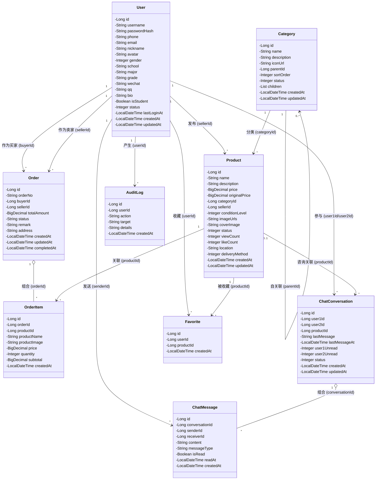

#### 2.3.2 服务层类关系图

```mermaid
classDiagram
    class UserService {
        <<interface>>
        +register(UserRegisterDTO) UserVO
        +login(String, String) UserVO
        +getUserInfo(Long) UserVO
        +getUserInfoByUsername(String) UserVO
        +updateProfile(Long, User) UserVO
        +updatePassword(Long, String, String) void
        +getUserEntityById(Long) User
        +sendResetCode(String) void
        +verifyAndResetPassword(String, String, String) void
    }

    class ProductService {
        <<interface>>
        +getProductList(ProductQueryDTO) List~ProductVO~
        +getProductCount(ProductQueryDTO) int
        +getProductDetail(Long) ProductVO
        +createProduct(ProductCreateDTO, Long) ProductVO
        +updateProduct(Long, ProductUpdateDTO, Long) ProductVO
        +deleteProduct(Long, Long) void
        +toggleProductStatus(Long, Long, Integer) void
        +getMyProducts(Long) List~ProductVO~
    }

    class CategoryService {
        <<interface>>
        +createCategory(CategoryCreateDTO) CategoryVO
        +updateCategory(Long, CategoryUpdateDTO) CategoryVO
        +deleteCategory(Long) void
        +getCategoryById(Long) CategoryVO
        +getAllCategories() List~CategoryVO~
        +getRootCategories() List~CategoryVO~
        +getCategoriesByParentId(Long) List~CategoryVO~
        +getCategoryTree() List~CategoryVO~
        +updateCategoryStatus(Long, Integer) void
    }

    class ChatService {
        <<interface>>
        +getConversations(Long) List~ConversationVO~
        +getOrCreateConversation(Long, Long, Long) ConversationVO
        +sendMessage(MessageSendDTO) ChatMessageVO
        +getMessages(Long) List~ChatMessageVO~
        +markAsRead(List~Long~) void
    }

    class OrderService {
        <<interface>>
        +createOrder(OrderCreateDTO, Long) OrderVO
        +getOrderDetail(Long, Long) OrderVO
        +getBuyerOrders(Long) List~OrderVO~
        +getSellerOrders(Long) List~OrderVO~
        +updateOrderStatus(Long, String, Long) void
        +cancelOrder(Long, Long) void
        +confirmOrder(Long, Long) void
    }

    class FavoriteService {
        <<interface>>
        +addFavorite(Long, Long) void
        +removeFavorite(Long, Long) void
        +getFavorites(Long) List~ProductVO~
    }

    class UserServiceImpl {
        -UserMapper userMapper
        -PasswordEncoder passwordEncoder
        +register(UserRegisterDTO) UserVO
        +login(String, String) UserVO
    }

    class ProductServiceImpl {
        -ProductMapper productMapper
        -CategoryMapper categoryMapper
        -UserMapper userMapper
        +getProductList(ProductQueryDTO) List~ProductVO~
        +createProduct(ProductCreateDTO, Long) ProductVO
    }

    class CategoryServiceImpl {
        -CategoryMapper categoryMapper
        +getCategoryTree() List~CategoryVO~
    }

    class ChatServiceImpl {
        -ChatConversationMapper convMapper
        -ChatMessageMapper msgMapper
        -UserMapper userMapper
        -ProductMapper productMapper
        +sendMessage(MessageSendDTO) ChatMessageVO
    }

    class OrderServiceImpl {
        -OrderMapper orderMapper
        -ProductMapper productMapper
        -UserMapper userMapper
        +createOrder(OrderCreateDTO, Long) OrderVO
    }

    class FavoriteServiceImpl {
        -FavoriteMapper favoriteMapper
        +addFavorite(Long, Long) void
    }

    UserService <|.. UserServiceImpl
    ProductService <|.. ProductServiceImpl
    CategoryService <|.. CategoryServiceImpl
    ChatService <|.. ChatServiceImpl
    OrderService <|.. OrderServiceImpl
    FavoriteService <|.. FavoriteServiceImpl
```

#### 2.3.3 系统整体架构类图

```mermaid
classDiagram
    class UserApi {
        -UserService userService
        -JwtUtil jwtUtil
        +register(UserLoginDTO) Result
        +login(UserLoginDTO) Result
        +getProfile() Result
        +updateProfile(User) Result
        +changePassword(Map) Result
        +sendResetCode(String) Result
        +resetPassword(Map) Result
    }

    class ProductController {
        -ProductService productService
        +getProductList(ProductQueryDTO) Result
        +getProductDetail(Long) Result
        +createProduct(ProductCreateDTO) Result
        +updateProduct(Long, ProductUpdateDTO) Result
        +deleteProduct(Long) Result
        +toggleProductStatus(Long, Integer) Result
    }

    class ChatController {
        -ChatService chatService
        +getConversations() Result
        +getOrCreateConversation(Long, Long) Result
        +sendMessage(MessageSendDTO) Result
        +getMessages(Long) Result
        +markAsRead(List~Long~) Result
    }

    class OrderController {
        -OrderService orderService
        +createOrder(OrderCreateDTO) Result
        +getOrderDetail(Long) Result
        +getBuyerOrders() Result
        +getSellerOrders() Result
        +updateOrderStatus(Long, Map) Result
        +cancelOrder(Long) Result
        +confirmOrder(Long) Result
    }

    class CategoryApi {
        -CategoryService categoryService
        +getCategoryTree() Result
        +getAllCategories() Result
        +createCategory(CategoryCreateDTO) Result
        +updateCategory(Long, CategoryUpdateDTO) Result
        +deleteCategory(Long) Result
        +updateCategoryStatus(Long, Integer) Result
    }

    class FavoriteController {
        -FavoriteService favoriteService
        +addFavorite(Long) Result
        +removeFavorite(Long) Result
        +getFavorites() Result
    }

    class SecurityConfig {
        -CustomUserDetailsService userDetailsService
        -JwtAuthenticationFilter jwtFilter
        +filterChain(HttpSecurity) SecurityFilterChain
        +passwordEncoder() PasswordEncoder
    }

    class JwtAuthenticationFilter {
        -JwtUtil jwtUtil
        -UserDetailsService userDetailsService
        +doFilterInternal(HttpServletRequest, HttpServletResponse, FilterChain) void
    }

    class GlobalExceptionHandler {
        +handleBusinessException(BusinessException) Result
        +handleNotFoundException(NotFoundException) Result
        +handleAuthenticationException(AuthenticationException) Result
        +handleAuthorizationException(AuthorizationException) Result
        +handleValidationException(MethodArgumentNotValidException) Result
        +handleException(Exception) Result
    }

    class Result~T~ {
        -Integer code
        -String message
        -T data
        +success(T) Result~T~
        +error(Integer, String) Result~T~
    }

    UserApi ..> Result : 返回
    ProductController ..> Result : 返回
    ChatController ..> Result : 返回
    OrderController ..> Result : 返回
    CategoryApi ..> Result : 返回
    FavoriteController ..> Result : 返回

    SecurityConfig --> JwtAuthenticationFilter : 注册过滤器
    GlobalExceptionHandler ..> Result : 构建响应
```

## 第三章 系统动态模型

### 3.1 顺序图

#### 3.1.1 用户登录顺序图

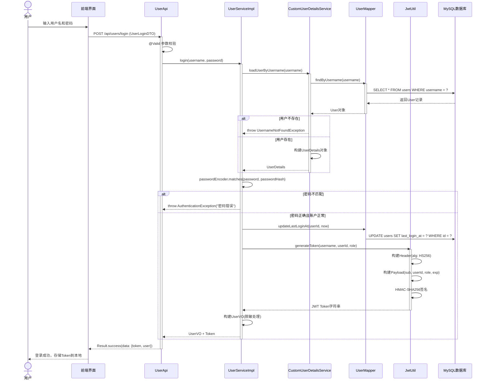

#### 3.1.2 创建订单顺序图

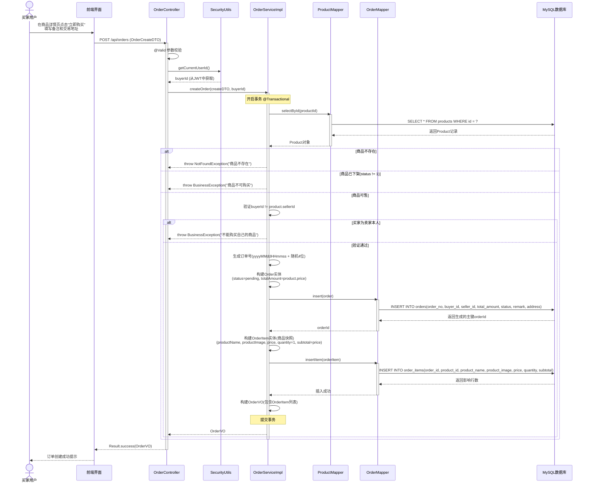

#### 3.1.3 发送聊天消息顺序图

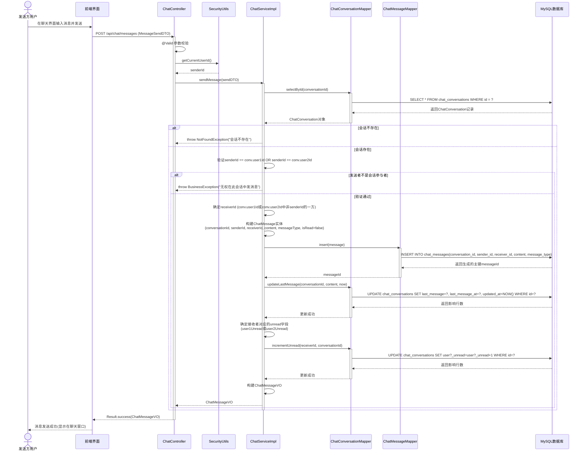

### 3.2 活动图

#### 3.2.1 用户注册活动图

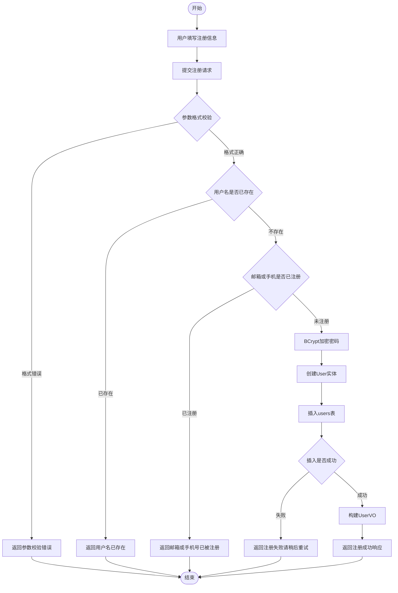

#### 3.2.2 商品搜索活动图

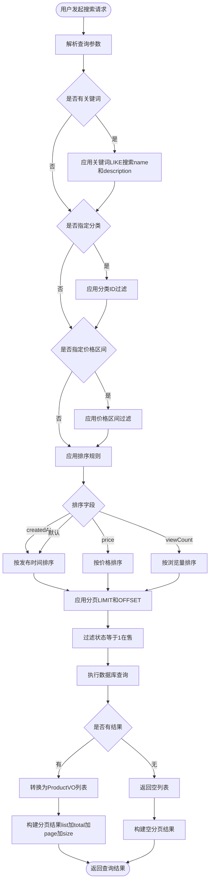

#### 3.2.3 订单处理流程活动图（带泳道）

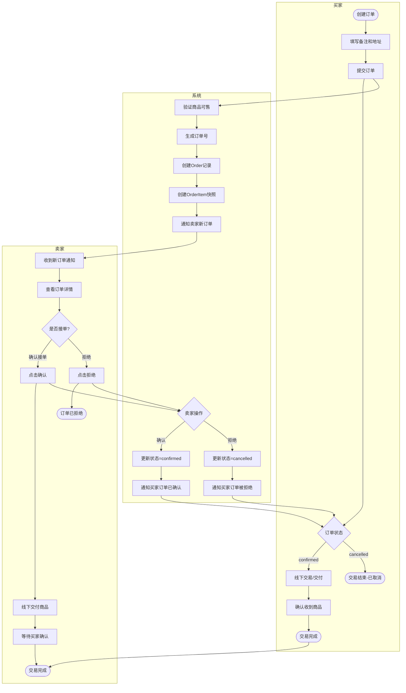

### 3.3 状态图

#### 3.3.1 订单状态图

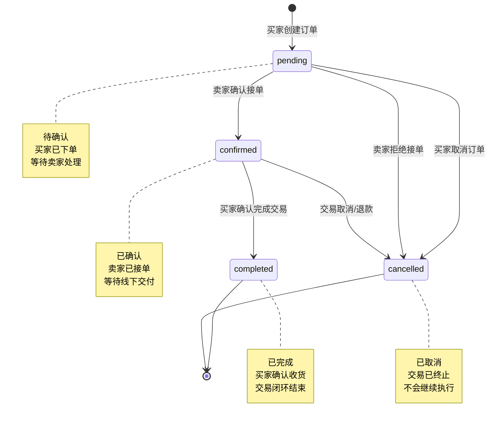

#### 3.3.2 商品状态图

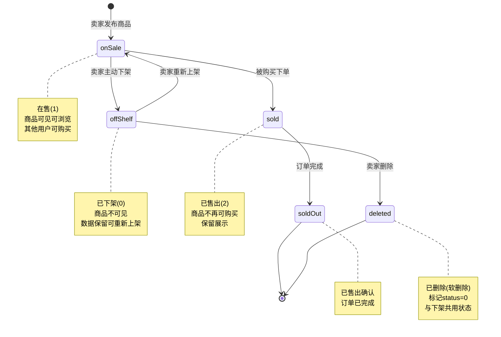

#### 3.3.3 用户账户状态图

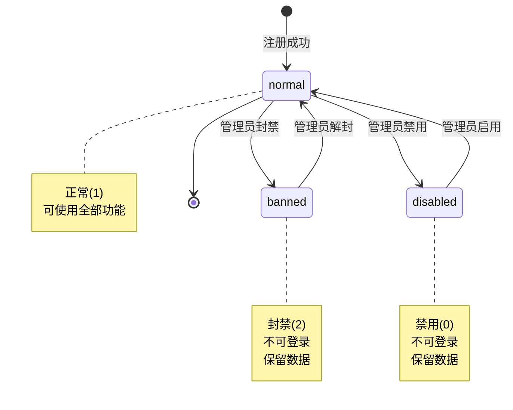

### 3.4 数据库设计

#### 3.4.1 数据库表总览

| 序号 | 表名                  | 说明    | 主键 |
| -- | ------------------- | ----- | -- |
| 1  | users               | 用户表   | id |
| 2  | products            | 商品表   | id |
| 3  | categories          | 分类表   | id |
| 4  | orders              | 订单表   | id |
| 5  | order\_items        | 订单项表  | id |
| 6  | favorites           | 收藏表   | id |
| 7  | chat\_conversations | 聊天会话表 | id |
| 8  | chat\_messages      | 聊天消息表 | id |
| 9  | audit\_logs         | 审计日志表 | id |

#### 3.4.2 表结构详细设计

**表1：users（用户表）**

| 字段名             | 数据类型         | 约束                                   | 说明          |
| --------------- | ------------ | ------------------------------------ | ----------- |
| id              | BIGINT       | PK, AUTO\_INCREMENT                  | 用户唯一标识      |
| username        | VARCHAR(50)  | UNIQUE, NOT NULL                     | 登录用户名       |
| password\_hash  | VARCHAR(255) | NOT NULL                             | BCrypt加密密码  |
| phone           | VARCHAR(20)  | UNIQUE                               | 手机号         |
| email           | VARCHAR(100) | -                                    | 邮箱          |
| nickname        | VARCHAR(50)  | -                                    | 昵称          |
| avatar          | VARCHAR(500) | -                                    | 头像URL       |
| gender          | INT          | DEFAULT 0                            | 0未知 1男 2女   |
| school          | VARCHAR(100) | -                                    | 学校名称        |
| major           | VARCHAR(100) | -                                    | 专业          |
| grade           | VARCHAR(50)  | -                                    | 年级          |
| wechat          | VARCHAR(50)  | -                                    | 微信号         |
| qq              | VARCHAR(20)  | -                                    | QQ号         |
| bio             | VARCHAR(500) | -                                    | 个人简介        |
| is\_student     | BOOLEAN      | DEFAULT TRUE                         | 是否在校学生      |
| status          | INT          | DEFAULT 1                            | 0禁用 1正常 2封禁 |
| last\_login\_at | DATETIME     | -                                    | 最后登录时间      |
| created\_at     | DATETIME     | DEFAULT CURRENT\_TIMESTAMP           | 创建时间        |
| updated\_at     | DATETIME     | DEFAULT CURRENT\_TIMESTAMP ON UPDATE | 更新时间        |

**索引设计：**

| 索引名          | 字段       | 类型   | 用途       |
| ------------ | -------- | ---- | -------- |
| PRIMARY      | id       | 主键   | 主键查询     |
| uk\_username | username | 唯一索引 | 登录查询、防重复 |
| idx\_status  | status   | 普通索引 | 按状态筛选    |
| idx\_phone   | phone    | 唯一索引 | 手机号查询    |

**表2：products（商品表）**

| 字段名              | 数据类型          | 约束                                   | 说明               |
| ---------------- | ------------- | ------------------------------------ | ---------------- |
| id               | BIGINT        | PK, AUTO\_INCREMENT                  | 商品唯一标识           |
| name             | VARCHAR(200)  | NOT NULL                             | 商品标题             |
| description      | TEXT          | -                                    | 详细描述             |
| price            | DECIMAL(10,2) | NOT NULL                             | 现售价格             |
| original\_price  | DECIMAL(10,2) | -                                    | 原价               |
| category\_id     | BIGINT        | FK->categories(id)                   | 分类ID             |
| seller\_id       | BIGINT        | FK->users(id), NOT NULL              | 卖家ID             |
| condition\_level | INT           | DEFAULT 5                            | 成色1-5            |
| image\_urls      | TEXT          | -                                    | 图片URL(JSON数组)    |
| cover\_image     | VARCHAR(500)  | -                                    | 封面图URL           |
| status           | INT           | DEFAULT 1                            | 0下架 1在售 2已售 3预约中 |
| view\_count      | INT           | DEFAULT 0                            | 浏览次数             |
| like\_count      | INT           | DEFAULT 0                            | 收藏次数             |
| location         | VARCHAR(200)  | -                                    | 交易地点             |
| delivery\_method | INT           | DEFAULT 3                            | 1自提 2快递 3均可      |
| created\_at      | DATETIME      | DEFAULT CURRENT\_TIMESTAMP           | 发布时间             |
| updated\_at      | DATETIME      | DEFAULT CURRENT\_TIMESTAMP ON UPDATE | 更新时间             |

**索引设计：**

| 索引名               | 字段           | 类型   | 用途       |
| ----------------- | ------------ | ---- | -------- |
| PRIMARY           | id           | 主键   | 主键查询     |
| idx\_seller\_id   | seller\_id   | 普通索引 | 查询卖家商品   |
| idx\_category\_id | category\_id | 普通索引 | 按分类筛选    |
| idx\_status       | status       | 普通索引 | 过滤在售商品   |
| idx\_created\_at  | created\_at  | 普通索引 | 按时间排序    |
| idx\_price        | price        | 普通索引 | 按价格排序/筛选 |

**表3：categories（分类表）**

| 字段名         | 数据类型         | 约束                                   | 说明      |
| ----------- | ------------ | ------------------------------------ | ------- |
| id          | BIGINT       | PK, AUTO\_INCREMENT                  | 分类唯一标识  |
| name        | VARCHAR(100) | NOT NULL                             | 分类名称    |
| description | VARCHAR(500) | -                                    | 分类描述    |
| icon\_url   | VARCHAR(500) | -                                    | 图标URL   |
| parent\_id  | BIGINT       | FK->categories(id), NULL             | 父分类ID   |
| sort\_order | INT          | DEFAULT 0                            | 排序序号    |
| status      | INT          | DEFAULT 1                            | 0禁用 1启用 |
| created\_at | DATETIME     | DEFAULT CURRENT\_TIMESTAMP           | 创建时间    |
| updated\_at | DATETIME     | DEFAULT CURRENT\_TIMESTAMP ON UPDATE | 更新时间    |

**表4：orders（订单表）**

| 字段名           | 数据类型          | 约束                                   | 说明     |
| ------------- | ------------- | ------------------------------------ | ------ |
| id            | BIGINT        | PK, AUTO\_INCREMENT                  | 订单唯一标识 |
| order\_no     | VARCHAR(32)   | UNIQUE, NOT NULL                     | 业务订单号  |
| buyer\_id     | BIGINT        | FK->users(id), NOT NULL              | 买家ID   |
| seller\_id    | BIGINT        | FK->users(id), NOT NULL              | 卖家ID   |
| total\_amount | DECIMAL(10,2) | NOT NULL                             | 订单总金额  |
| status        | VARCHAR(20)   | NOT NULL, DEFAULT 'pending'          | 订单状态   |
| remark        | VARCHAR(500)  | -                                    | 买家备注   |
| address       | VARCHAR(500)  | -                                    | 交易地址   |
| created\_at   | DATETIME      | DEFAULT CURRENT\_TIMESTAMP           | 创建时间   |
| updated\_at   | DATETIME      | DEFAULT CURRENT\_TIMESTAMP ON UPDATE | 更新时间   |
| completed\_at | DATETIME      | -                                    | 完成时间   |

**索引设计：**

| 索引名             | 字段         | 类型   | 用途     |
| --------------- | ---------- | ---- | ------ |
| PRIMARY         | id         | 主键   | 主键查询   |
| uk\_order\_no   | order\_no  | 唯一索引 | 订单号查询  |
| idx\_buyer\_id  | buyer\_id  | 普通索引 | 买家订单列表 |
| idx\_seller\_id | seller\_id | 普通索引 | 卖家订单列表 |
| idx\_status     | status     | 普通索引 | 按状态筛选  |

**表5：order\_items（订单项表）**

| 字段名            | 数据类型          | 约束                         | 说明        |
| -------------- | ------------- | -------------------------- | --------- |
| id             | BIGINT        | PK, AUTO\_INCREMENT        | 订单项唯一标识   |
| order\_id      | BIGINT        | FK->orders(id), NOT NULL   | 所属订单ID    |
| product\_id    | BIGINT        | NOT NULL                   | 商品ID（快照）  |
| product\_name  | VARCHAR(200)  | -                          | 商品名称（快照）  |
| product\_image | VARCHAR(500)  | -                          | 商品图片（快照）  |
| price          | DECIMAL(10,2) | NOT NULL                   | 下单时单价（快照） |
| quantity       | INT           | DEFAULT 1                  | 数量        |
| subtotal       | DECIMAL(10,2) | NOT NULL                   | 小计金额      |
| created\_at    | DATETIME      | DEFAULT CURRENT\_TIMESTAMP | 创建时间      |

**表6：favorites（收藏表）**

| 字段名         | 数据类型     | 约束                         | 说明     |
| ----------- | -------- | -------------------------- | ------ |
| id          | BIGINT   | PK, AUTO\_INCREMENT        | 收藏唯一标识 |
| user\_id    | BIGINT   | FK->users(id), NOT NULL    | 用户ID   |
| product\_id | BIGINT   | FK->products(id), NOT NULL | 商品ID   |
| created\_at | DATETIME | DEFAULT CURRENT\_TIMESTAMP | 收藏时间   |

**索引设计：**

| 索引名               | 字段                      | 类型     | 用途     |
| ----------------- | ----------------------- | ------ | ------ |
| PRIMARY           | id                      | 主键     | 主键查询   |
| uk\_user\_product | (user\_id, product\_id) | 联合唯一索引 | 防止重复收藏 |
| idx\_user\_id     | user\_id                | 普通索引   | 用户收藏列表 |
| idx\_product\_id  | product\_id             | 普通索引   | 商品收藏统计 |

**表7：chat\_conversations（聊天会话表）**

| 字段名               | 数据类型         | 约束                                   | 说明       |
| ----------------- | ------------ | ------------------------------------ | -------- |
| id                | BIGINT       | PK, AUTO\_INCREMENT                  | 会话唯一标识   |
| user1\_id         | BIGINT       | FK->users(id), NOT NULL              | 参与者1 ID  |
| user2\_id         | BIGINT       | FK->users(id), NOT NULL              | 参与者2 ID  |
| product\_id       | BIGINT       | FK->products(id), NULL               | 关联商品ID   |
| last\_message     | VARCHAR(500) | -                                    | 最后消息内容   |
| last\_message\_at | DATETIME     | -                                    | 最后消息时间   |
| user1\_unread     | INT          | DEFAULT 0                            | 用户1未读数   |
| user2\_unread     | INT          | DEFAULT 0                            | 用户2未读数   |
| status            | INT          | DEFAULT 1                            | 0已关闭 1正常 |
| created\_at       | DATETIME     | DEFAULT CURRENT\_TIMESTAMP           | 创建时间     |
| updated\_at       | DATETIME     | DEFAULT CURRENT\_TIMESTAMP ON UPDATE | 更新时间     |

**表8：chat\_messages（聊天消息表）**

| 字段名              | 数据类型        | 约束                                    | 说明                |
| ---------------- | ----------- | ------------------------------------- | ----------------- |
| id               | BIGINT      | PK, AUTO\_INCREMENT                   | 消息唯一标识            |
| conversation\_id | BIGINT      | FK->chat\_conversations(id), NOT NULL | 所属会话ID            |
| sender\_id       | BIGINT      | FK->users(id), NOT NULL               | 发送者ID             |
| receiver\_id     | BIGINT      | FK->users(id), NOT NULL               | 接收者ID             |
| content          | TEXT        | NOT NULL                              | 消息内容              |
| message\_type    | VARCHAR(20) | DEFAULT 'text'                        | text/image/system |
| is\_read         | BOOLEAN     | DEFAULT FALSE                         | 是否已读              |
| read\_at         | DATETIME    | -                                     | 阅读时间              |
| created\_at      | DATETIME    | DEFAULT CURRENT\_TIMESTAMP            | 发送时间              |

**索引设计：**

| 索引名                   | 字段               | 类型   | 用途     |
| --------------------- | ---------------- | ---- | ------ |
| PRIMARY               | id               | 主键   | 主键查询   |
| idx\_conversation\_id | conversation\_id | 普通索引 | 会话消息列表 |
| idx\_receiver\_id     | receiver\_id     | 普通索引 | 接收消息查询 |
| idx\_is\_read         | is\_read         | 普通索引 | 未读消息筛选 |

#### 3.4.3 表间关系图（ER图）

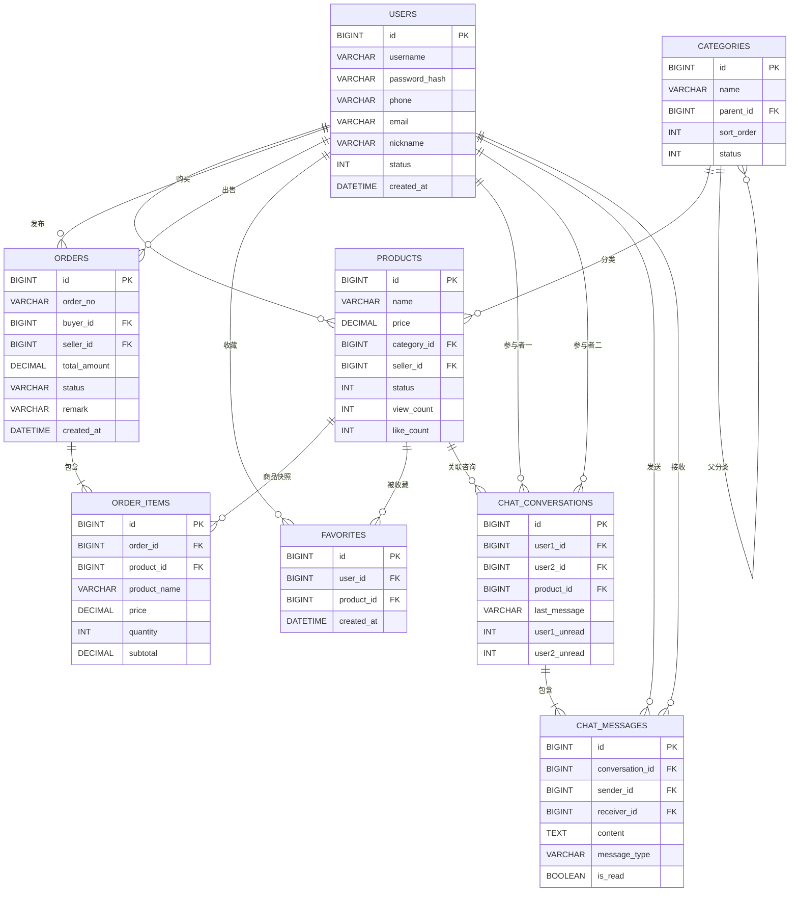

#### 3.4.4 数据库设计原则

| 原则            | 说明                                              |
| ------------- | ----------------------------------------------- |
| **第三范式（3NF）** | 消除非主属性对主键的传递依赖，确保数据一致性                          |
| **外键约束**      | 通过FK保证引用完整性，如订单的buyer\_id必须引用有效的user.id         |
| **数据快照**      | 订单项保存商品名称/图片/价格快照，防止商品信息变更后订单数据不一致              |
| **软删除**       | 商品和分类删除通过status字段标记，保留历史数据可追溯                   |
| **审计字段**      | 所有表包含created\_at和updated\_at，支持操作追溯             |
| **索引优化**      | 对高频查询字段（外键、状态、时间）建立索引，提升查询性能                    |
| **联合唯一约束**    | favorites表使用(user\_id, product\_id)联合唯一索引防止重复收藏 |

### 3.6 用户界面设计

#### 3.6.1 界面总体布局

系统前端采用单页面应用（SPA）架构，主要布局结构如下：

```
┌─────────────────────────────────────────────────────────┐
│                       顶部导航栏                          │
│  [Logo]  [搜索框]                    [消息] [我的] [发布]  │
├─────────────────────────────────────────────────────────┤
│                                                         │
│                    主内容区域                              │
│           （根据路由动态切换页面内容）                       │
│                                                         │
├─────────────────────────────────────────────────────────┤
│                       底部标签栏                           │
│           [首页] [分类] [发布] [消息] [我的]               │
└─────────────────────────────────────────────────────────┘
```

#### 3.6.2 关键界面设计

**界面1：登录/注册页**

| 元素     | 类型            | 功能说明          |
| ------ | ------------- | ------------- |
| 用户名输入框 | TextField     | 输入用户名（必填）     |
| 密码输入框  | PasswordField | 输入密码（必填，密文显示） |
| 登录按钮   | Button        | 提交登录请求        |
| 注册链接   | Link          | 跳转至注册页        |
| 忘记密码链接 | Link          | 跳转至密码重置页      |

**交互逻辑**：用户输入凭据后点击登录，前端调用`POST /api/users/login`接口。登录成功后，将JWT Token存储至localStorage，跳转至首页。登录失败则显示错误提示。

**界面2：商品列表页（首页）**

| 元素     | 类型             | 功能说明             |
| ------ | -------------- | ---------------- |
| 搜索框    | SearchBar      | 关键词搜索商品          |
| 分类筛选器  | Dropdown/Tag   | 按分类过滤            |
| 价格筛选器  | RangeInput     | 设置价格区间           |
| 排序选择器  | Select         | 按发布时间/价格/浏览量排序   |
| 商品卡片列表 | CardGrid       | 展示商品封面图、标题、价格、成色 |
| 分页控件   | Pagination     | 翻页浏览             |
| 下拉加载更多 | InfiniteScroll | 移动端无限滚动加载        |

**交互逻辑**：页面加载时调用`GET /api/products`获取商品列表。用户操作筛选条件时，实时更新查询参数并重新请求数据。点击商品卡片跳转至商品详情页。

**界面3：商品详情页**

| 元素       | 类型            | 功能说明         |
| -------- | ------------- | ------------ |
| 商品图片轮播   | ImageCarousel | 多图滑动浏览       |
| 商品标题     | Text(H1)      | 显示商品名称       |
| 价格标签     | Text(Price)   | 显示现价和原价（划线）  |
| 成色标签     | Badge         | 显示成色等级文字     |
| 商品描述     | Text          | 显示详细描述       |
| 卖家信息卡片   | Card          | 显示卖家头像、昵称、学校 |
| 浏览次数     | Text          | 显示viewCount  |
| "聊一聊"按钮  | Button        | 与卖家发起聊天      |
| "立即购买"按钮 | Button        | 创建购买订单       |
| 收藏按钮     | Icon(Button)  | 收藏/取消收藏      |
| 分享按钮     | Icon(Button)  | 分享商品链接       |

**交互逻辑**：页面加载时调用`GET /api/products/{id}`获取商品详情，同时该接口自动增加浏览量。点击"聊一聊"调用聊天接口创建会话。点击"立即购买"跳转至订单确认页。

**界面4：聊天列表页**

| 元素   | 类型            | 功能说明                  |
| ---- | ------------- | --------------------- |
| 会话列表 | ListView      | 显示所有聊天会话              |
| 会话项  | ListItem      | 显示对方头像、昵称、最后消息、未读数、时间 |
| 搜索框  | SearchBar     | 搜索会话                  |
| 下拉刷新 | PullToRefresh | 刷新会话列表                |

**交互逻辑**：页面加载时调用`GET /api/chat/conversations`获取会话列表，按lastMessageAt降序排列。点击会话项跳转至聊天详情页。

**界面5：聊天详情页**

| 元素     | 类型        | 功能说明          |
| ------ | --------- | ------------- |
| 消息列表   | ListView  | 显示聊天记录（气泡式）   |
| 消息输入框  | TextInput | 输入消息内容        |
| 发送按钮   | Button    | 发送消息          |
| 对方信息栏  | Header    | 显示对方昵称和状态     |
| 关联商品卡片 | Card      | 显示咨询的商品信息（如有） |

**交互逻辑**：进入页面时调用`GET /api/chat/messages/{conversationId}`加载历史消息。发送消息调用`POST /api/chat/messages`。离开页面时自动标记消息为已读。

**界面6：订单管理页**

| 元素    | 类型          | 功能说明                                    |
| ----- | ----------- | --------------------------------------- |
| Tab切换 | Tabs        | 我买到的 / 我卖出的                             |
| 订单列表  | ListView    | 显示订单卡片                                  |
| 订单项   | Card        | 显示商品图、名称、价格、订单状态                        |
| 状态标签  | Badge       | 显示pending/confirmed/completed/cancelled |
| 操作按钮  | ButtonGroup | 根据状态显示不同操作（确认/拒绝/取消/完成）                 |

**交互逻辑**：买家视角调用`GET /api/orders/buyer`，卖家视角调用`GET /api/orders/seller`。根据订单状态动态显示操作按钮。

**界面7：发布商品页**

| 元素      | 类型                | 功能说明         |
| ------- | ----------------- | ------------ |
| 图片上传区   | ImageUploader     | 上传商品图片（支持多图） |
| 标题输入框   | TextField         | 商品标题（必填）     |
| 描述输入框   | TextArea          | 商品详细描述       |
| 价格输入框   | NumberInput       | 现售价格（必填，>0）  |
| 原价输入框   | NumberInput       | 原价（可选）       |
| 分类选择器   | Picker/TreeSelect | 选择商品分类       |
| 成色选择器   | RadioGroup        | 选择成色等级1-5    |
| 交易地点输入框 | TextField         | 交易地点         |
| 交付方式选择  | RadioGroup        | 自提/快递/均可     |
| 提交按钮    | Button            | 发布商品         |

**交互逻辑**：填写完成后点击提交，前端校验必填项后调用`POST /api/products`。发布成功跳转至商品详情页。

**界面8：个人中心页**

| 元素     | 类型       | 功能说明           |
| ------ | -------- | -------------- |
| 用户头像   | Avatar   | 显示用户头像         |
| 用户昵称   | Text     | 显示用户昵称         |
| 学校信息   | Text     | 显示学校和专业        |
| 编辑资料入口 | MenuItem | 跳转至资料编辑页       |
| 我的商品   | MenuItem | 跳转至我的商品列表      |
| 我的收藏   | MenuItem | 跳转至收藏列表        |
| 我的订单   | MenuItem | 跳转至订单管理页       |
| 修改密码   | MenuItem | 跳转至密码修改页       |
| 退出登录   | Button   | 清除Token并跳转至登录页 |

#### 3.6.3 界面与后台功能对应关系

| 前端界面  | 后台API接口                                    | HTTP方法      |
| ----- | ------------------------------------------ | ----------- |
| 登录页   | `/api/users/login`                         | POST        |
| 注册页   | `/api/users/register`                      | POST        |
| 商品列表页 | `/api/products`                            | GET         |
| 商品详情页 | `/api/products/{id}`                       | GET         |
| 发布商品页 | `/api/products`                            | POST        |
| 编辑商品页 | `/api/products/{id}`                       | PUT         |
| 聊天列表页 | `/api/chat/conversations`                  | GET         |
| 聊天详情页 | `/api/chat/messages/{conversationId}`      | GET         |
| 发送消息  | `/api/chat/messages`                       | POST        |
| 订单列表页 | `/api/orders/buyer` 或 `/api/orders/seller` | GET         |
| 创建订单  | `/api/orders`                              | POST        |
| 收藏操作  | `/api/favorites/{productId}`               | POST/DELETE |
| 分类浏览  | `/api/categories/tree`                     | GET         |

## 第四章 系统部署

### 4.1 组件图

```mermaid
graph TB
    subgraph "表现层"
        WebFrontend["Web前端SPA"]
        SwaggerUI["Swagger UI"]
    end

    subgraph "应用服务层"
        subgraph "Controller组件"
            CtrlUser["UserApi"]
            CtrlProduct["ProductController"]
            CtrlChat["ChatController"]
            CtrlOrder["OrderController"]
            CtrlCategory["CategoryApi"]
            CtrlFavorite["FavoriteController"]
        end

        subgraph "Service组件"
            SvcUser["UserServiceImpl"]
            SvcProduct["ProductServiceImpl"]
            SvcChat["ChatServiceImpl"]
            SvcOrder["OrderServiceImpl"]
            SvcCategory["CategoryServiceImpl"]
            SvcFavorite["FavoriteServiceImpl"]
        end

        subgraph "Mapper组件"
            MapUser["UserMapper"]
            MapProduct["ProductMapper"]
            MapChat["ChatMapper"]
            MapOrder["OrderMapper"]
            MapCategory["CategoryMapper"]
            MapFavorite["FavoriteMapper"]
        end

        subgraph "安全组件"
            SecConfig["SecurityConfig"]
            JwtFilter["JwtAuthenticationFilter"]
            UserDetailSvc["CustomUserDetailsService"]
            JwtUtil["JwtUtil"]
        end

        subgraph "支撑组件"
            GExceptionHandler["GlobalExceptionHandler"]
            LogAspect["LoggingAspect"]
            ApiVerInterceptor["ApiVersionInterceptor"]
            RedisUtil["RedisUtil"]
        end
    end

    subgraph "数据层"
        MySQL[("MySQL 8.x")]
        RedisDB[("Redis")]
    end

    subgraph "外部服务"
        EmailSvc["邮件服务SMTP"]
    end

    WebFrontend --> CtrlUser
    WebFrontend --> CtrlProduct
    WebFrontend --> CtrlChat
    WebFrontend --> CtrlOrder
    WebFrontend --> CtrlCategory
    WebFrontend --> CtrlFavorite

    SwaggerUI --> CtrlUser
    SwaggerUI --> CtrlProduct

    CtrlUser --> SvcUser
    CtrlProduct --> SvcProduct
    CtrlChat --> SvcChat
    CtrlOrder --> SvcOrder
    CtrlCategory --> SvcCategory
    CtrlFavorite --> SvcFavorite

    SvcUser --> MapUser
    SvcProduct --> MapProduct
    SvcProduct --> MapCategory
    SvcChat --> MapChat
    SvcOrder --> MapOrder
    SvcCategory --> MapCategory
    SvcFavorite --> MapFavorite

    MapUser --> MySQL
    MapProduct --> MySQL
    MapChat --> MySQL
    MapOrder --> MySQL
    MapCategory --> MySQL
    MapFavorite --> MySQL

    SecConfig --> JwtFilter
    JwtFilter --> JwtUtil
    JwtFilter --> UserDetailSvc
    UserDetailSvc --> MapUser

    SvcUser --> RedisUtil
    SvcProduct --> RedisUtil
    SvcCategory --> RedisUtil
    RedisUtil --> RedisDB

    LogAspect -.-> SvcUser
    LogAspect -.-> SvcProduct
    LogAspect -.-> SvcChat

    GExceptionHandler -.-> CtrlUser
    GExceptionHandler -.-> CtrlProduct

    ApiVerInterceptor -.-> CtrlUser
    ApiVerInterceptor -.-> CtrlProduct

    SvcUser --> EmailSvc
```

#### 4.1.1 组件说明

| 组件               | 职责                      | 接口/依赖                            |
| ---------------- | ----------------------- | -------------------------------- |
| **Web前端 SPA**    | 用户交互界面，调用后端API          | RESTful API接口                    |
| **Swagger UI**   | API文档展示与在线测试            | SpringDoc OpenAPI                |
| **Controller组件** | 接收HTTP请求，参数校验，调用Service | Spring MVC @RestController       |
| **Service组件**    | 核心业务逻辑实现，事务管理           | Spring @Service + @Transactional |
| **Mapper组件**     | 数据访问层，封装SQL操作           | MyBatis @Mapper                  |
| **安全组件**         | JWT认证、权限控制、用户认证         | Spring Security Filter Chain     |
| **支撑组件**         | 异常处理、日志切面、API版本、缓存      | Spring AOP / Interceptor         |
| **MySQL 8.x**    | 关系型数据存储                 | JDBC/MyBatis                     |
| **Redis**        | 缓存存储、验证码临时存储            | Jedis/Lettuce RESP协议             |
| **邮件服务**         | 密码重置验证码发送               | SMTP协议                           |

### 4.2 部署图

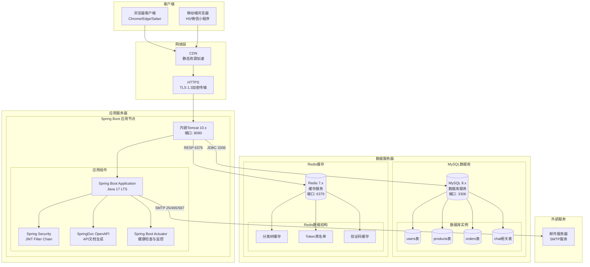

#### 4.2.1 物理节点说明

| 节点         | 运行环境                          | 说明                                         |
| ---------- | ----------------------------- | ------------------------------------------ |
| **客户端**    | 现代浏览器                         | Chrome 90+, Edge 90+, Safari 14+, 移动端H5浏览器 |
| **应用服务器**  | Java 17 LTS + Spring Boot 3.x | 内嵌Tomcat 10.x，端口8080，可部署于云服务器或本地服务器        |
| **数据库服务器** | MySQL 8.x                     | 关系型数据库，存储全部业务数据，建议单独部署或使用云数据库服务            |
| **缓存服务器**  | Redis 7.x                     | 内存数据库，用于缓存分类树、用户信息、验证码等高频访问数据              |
| **邮件服务器**  | SMTP服务                        | 用于发送密码重置验证码邮件，可使用第三方SMTP服务（如QQ邮箱、163邮箱）    |

#### 4.2.2 部署模式

| 部署模式     | 说明                                               | 适用场景      |
| -------- | ------------------------------------------------ | --------- |
| **开发环境** | 所有服务运行在本地，使用application-dev.yml配置                | 本地开发和调试   |
| **测试环境** | 应用与数据库部署在测试服务器，使用application.yml默认配置             | 功能测试和集成测试 |
| **生产环境** | 应用部署在云服务器，使用独立数据库和Redis，使用application-prod.yml配置 | 正式上线运行    |

#### 4.2.3 运行环境要求

| 组件       | 最低配置                   | 推荐配置                    |
| -------- | ---------------------- | ----------------------- |
| 应用服务器    | 2核CPU / 2GB内存 / 20GB存储 | 4核CPU / 4GB内存 / 50GB存储  |
| MySQL数据库 | 2核CPU / 2GB内存 / 50GB存储 | 4核CPU / 4GB内存 / 100GB存储 |
| Redis缓存  | 1核CPU / 512MB内存        | 2核CPU / 1GB内存           |

#### 4.2.4 通信协议

| 通信路径           | 协议             | 端口         | 加密           |
| -------------- | -------------- | ---------- | ------------ |
| 客户端 -> 应用服务器   | HTTPS (HTTP/2) | 443        | TLS 1.3      |
| 应用服务器 -> MySQL | JDBC (TCP)     | 3306       | 可选SSL        |
| 应用服务器 -> Redis | RESP (TCP)     | 6379       | 内网通信         |
| 应用服务器 -> 邮件服务器 | SMTP/SMTPS     | 25/465/587 | STARTTLS/SSL |

#### 4.2.5 健康检查

系统通过Spring Boot Actuator提供以下监控端点：

| 端点   | 路径                  | 功能              | 生产环境暴露   |
| ---- | ------------------- | --------------- | -------- |
| 健康检查 | `/actuator/health`  | 检查应用及数据库连接状态    | 是（仅授权用户） |
| 应用信息 | `/actuator/info`    | 返回应用版本、Java版本等  | 是        |
| 性能指标 | `/actuator/metrics` | JVM内存、HTTP请求统计等 | 否（仅开发环境） |

## 第五章 总结与展望

### 总结

本系统设计说明书采用面向对象分析方法（OOA），对"校园二手交易平台"进行了全面、系统的设计。文档严格遵循软件工程规范，从需求分析、静态模型、动态模型到系统部署，逐层递进，确保设计内容的完整性和一致性。

#### 核心设计成果回顾

1. **需求分析阶段**：识别出3类主要参与者（访客、注册用户、系统管理员），定义了22个核心用例，并通过用例图和详细的用例描述明确了系统的功能边界和业务规则。
2. **静态模型设计**：识别出9个核心实体类（User、Product、Category、Order、OrderItem、ChatConversation、ChatMessage、Favorite、AuditLog）、6个服务类、6个控制器类及多个DTO/VO对象。通过类图清晰展示了类之间的关联、组合和自关联关系。
3. **动态模型设计**：通过3个核心顺序图（用户登录、创建订单、发送聊天消息）展示了对象间的交互流程；通过3个活动图（用户注册、商品搜索、订单处理）展示了业务流程的分支和并行逻辑；通过3个状态图（订单、商品、用户账户）展示了核心对象的生命周期和状态变迁。
4. **数据库设计**：设计了9张数据表，满足第三范式要求，通过外键保证引用完整性，通过数据快照（OrderItem）保证历史数据一致性，通过合理的索引设计优化查询性能。
5. **部署设计**：采用经典的三层架构（表现层-应用层-数据层），通过Spring Boot内嵌Tomcat实现轻量级部署，利用Redis提供缓存能力，通过HTTPS保证传输安全。

#### 关键设计决策

| 决策项   | 选择                        | 依据                 |
| ----- | ------------------------- | ------------------ |
| 技术框架  | Spring Boot 3.x + Java 17 | 生态成熟、社区活跃、开发效率高    |
| 持久层方案 | MyBatis                   | SQL可控、适合复杂查询、学习成本低 |
| 认证方式  | JWT无状态认证                  | 适合前后端分离架构、天然支持水平扩展 |
| 密码加密  | BCrypt                    | 强哈希算法、自带盐值、抗彩虹表攻击  |
| 删除策略  | 软删除（status标记）             | 保留历史数据、支持数据恢复      |
| 订单设计  | 无在线支付                     | 校园场景线下交易为主、降低系统复杂度 |
| 聊天实现  | HTTP轮询（非WebSocket）        | 简化架构、满足校园场景实时性要求   |

本设计完全满足需求分析阶段提出的目标：提供从商品发布、浏览搜索、私信协商到订单管理的完整C2C交易闭环，基于校园身份认证建立信任基础，替代传统线下二手交易方式。

### 展望

#### 未来扩展方向

1. **实时通信升级**：引入WebSocket + STOMP协议替代HTTP轮询，实现消息实时推送，提升聊天体验。可进一步支持图片、语音等多媒体消息类型。
2. **在线支付集成**：接入支付宝/微信支付SDK，实现线上支付功能，覆盖从下单到付款的完整交易闭环。同时引入担保交易机制，提升交易安全性。
3. **全文搜索引擎**：集成Elasticsearch，实现商品全文检索、拼音搜索、模糊匹配等高级搜索能力，大幅提升搜索效率和准确度。
4. **推荐系统**：基于用户浏览历史、收藏记录和购买行为，构建协同过滤推荐算法，实现"猜你喜欢"功能，提升用户活跃度和交易转化率。
5. **文件存储服务**：集成阿里云OSS或腾讯云COS，提供商品图片的上传、存储、CDN分发能力，替代当前的URL字符串方案。
6. **消息队列**：引入RabbitMQ或Kafka，将邮件发送、审计日志写入等非关键路径操作异步化，提升系统响应速度。
7. **微服务化**：随着业务规模增长，可将用户服务、商品服务、订单服务、聊天服务拆分为独立微服务，通过Spring Cloud实现服务治理。
8. **容器化部署**：使用Docker容器化应用，通过Docker Compose编排多服务，或通过Kubernetes实现弹性扩缩容和高可用部署。

#### 后续开发建议

| 阶段       | 重点关注                                                                          |
| -------- | ----------------------------------------------------------------------------- |
| **开发阶段** | 严格遵循分层架构，确保Controller只负责请求接收和响应封装，核心业务逻辑全部在Service层实现；使用@Transactional保证事务一致性 |
| **测试阶段** | 编写充分的单元测试覆盖Service层核心逻辑；使用MockMvc进行Controller层集成测试；编写端到端测试验证核心业务流程            |
| **安全加固** | 对所有用户输入进行严格校验和过滤，防止SQL注入和XSS攻击；定期审查JWT Secret强度；实施接口限流防止暴力破解                  |
| **性能优化** | 对慢查询SQL进行EXPLAIN分析并优化索引；合理使用Redis缓存热点数据；考虑引入分页查询替代全量加载                        |

#### 系统可维护性设计

- **统一异常处理**：通过`GlobalExceptionHandler`统一处理所有Controller异常，返回一致的响应格式
- **日志切面**：通过AOP自动记录Service层方法调用日志，便于问题排查和性能分析
- **审计日志**：关键业务操作（订单创建、商品删除等）记录审计日志，支持操作追溯
- **API版本管理**：通过`@ApiVersion`注解和拦截器支持API版本控制，确保向后兼容
- **配置分离**：通过Spring Profile实现开发/测试/生产环境配置隔离

#### 系统可扩展性设计

- **分层解耦**：Controller-Service-Mapper三层架构，各层职责清晰，便于独立扩展
- **接口抽象**：Service层定义接口，实现类可灵活替换（如切换ORM框架）
- **无状态认证**：JWT无状态认证天然支持水平扩展，无需Session共享
- **配置外部化**：所有配置通过application.yml管理，便于动态调整和热更新

***

**文档版本**：1.0\
**撰写日期**：2026-04-29

## 参考文献

\[1] 张海藩, 牟永敏. 软件工程导论（第6版）\[M]. 北京: 清华大学出版社, 2013.

\[2] Grady Booch, James Rumbaugh, Ivar Jacobson. The Unified Modeling Language User Guide (2nd Edition)\[M]. Addison-Wesley Professional, 2005.

\[3] Craig Walls. Spring Boot in Action\[M]. Manning Publications, 2016.

\[4] 陈雄华, 林开益. Spring MVC学习指南（第2版）\[M]. 北京: 电子工业出版社, 2017.

\[5] Clinton Begin. MyBatis 3 User Guide\[EB/OL]. <https://mybatis.org/mybatis-3/>, 2024.

\[6] Oracle Corporation. MySQL 8.0 Reference Manual\[EB/OL]. <https://dev.mysql.com/doc/refman/8.0/en/>, 2024.

\[7] Redis Ltd. Redis Documentation\[EB/OL]. <https://redis.io/docs/>, 2024.

\[8] Spring Project. Spring Security Reference\[EB/OL]. <https://docs.spring.io/spring-security/reference/>, 2024.

\[9] Jones S, Cushman D. JWT (JSON Web Token) Authentication for Modern Web Applications\[J]. Journal of Cybersecurity Technology, 2021, 5(2): 45-58.

\[10] 刘晓华. 基于BCrypt算法的密码加密方案研究\[J]. 计算机安全, 2019(8): 23-27.

\[11] Martin Fowler. Patterns of Enterprise Application Architecture\[M]. Addison-Wesley Professional, 2002.

\[12] Eric Evans. Domain-Driven Design: Tackling Complexity in the Heart of Software\[M]. Addison-Wesley Professional, 2003.

\[13] OpenAPI Initiative. OpenAPI Specification Version 3.0.3\[EB/OL]. <https://spec.openapis.org/oas/v3.0.3>, 2020.

\[14] Mermaid Project. Mermaid Documentation\[EB/OL]. <https://mermaid.js.org/>, 2024.

\[15] 王珊, 萨师煊. 数据库系统概论（第5版）\[M]. 北京: 高等教育出版社, 2014.
